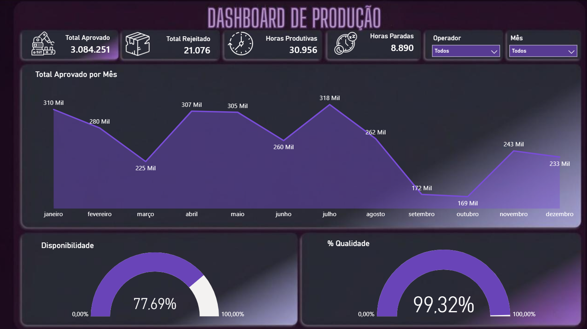

# 🚀 Dashboard de Produção — Power BI

  
  
  

---

## 📌 Sobre o Projeto

Este projeto foi desenvolvido no Power BI com foco em análise de indicadores de produção e performance operacional.

O objetivo é transformar dados operacionais em insights estratégicos para apoio na tomada de decisão.

O dashboard permite acompanhar métricas importantes de eficiência, qualidade e produtividade de forma visual e interativa.

---

# 🛠️ Tecnologias Utilizadas

- Power BI
- Power Query
- Excel
- DAX (Medidas e KPIs)

---

# 📊 Principais Análises

## 🔹 Eficiência Operacional  
Monitoramento da performance geral da produção.

## 🔹 Disponibilidade de Produção  
Análise de tempo produtivo vs tempo parado.

## 🔹 Qualidade da Produção  
Comparação entre produtos aprovados e rejeitados.

## 🔹 Indicadores de Performance  
KPIs para acompanhamento estratégico da produção.

---

# 📸 Dashboard

  

---

# 🔗 Acesse o Dashboard

👉 https://app.powerbi.com/view?r=eyJrIjoiMzA1Y2RhMTItYzdiZS00YWM2LTlhNDktMTYyM2M3MTQ3NjEzIiwidCI6ImU1ZGMwMjY0LTdlOTctNDdlMC05MWU0LWY0MWJkNTc5NDkzZCJ9

---

# ✨ Objetivo do Projeto

Desenvolver habilidades em Business Intelligence através da criação de um dashboard interativo, com foco em análise de dados e geração de insights para melhoria de processos operacionais.
